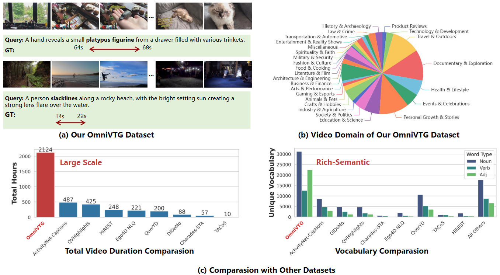

# OmniVTG: A Large-Scale Dataset and Training Paradigm for Open-World Video Temporal Grounding

<div align="center">

[](https://arxiv.org/abs/2604.25276)
[](https://huggingface.co/zhengmh/OmniVTG-7B)
[](https://modelscope.cn/models/zhengmh/OmniVTG-7B)
[](https://huggingface.co/datasets/zhengmh/OmniVTG-Dataset)
[](https://minghangz.github.io/publication/omnivtg/)

**[CVPR 2026]** Official PyTorch Implementation for OmniVTG.



</div>

## 📖 Introduction

**Video Temporal Grounding (VTG)** aims to localize specific video segments using natural language queries in untrimmed videos. However, extending VTG to open-world applications presents significant challenges due to the limited scale and semantic diversity of existing datasets. 

To overcome these limitations, we introduce **OmniVTG**, a new large-scale dataset designed for open-world VTG. Alongside the dataset, we propose a **Self-Correction Chain-of-Thought (CoT)** training paradigm tailored to unleash the grounding capabilities of Multimodal Large Language Models (MLLMs).

### ✨ Highlights

- 📊 **OmniVTG Dataset:** A large-scale dataset featuring over **2,000 hours** of video content with rich semantic diversity.
- 🚀 **OmniVTG Model:** Powered by our OmniVTG Dataset and the Self-Correction CoT training paradigm, our model achieves strong zero-shot localization performance across four major VTG benchmarks.

---

## 📑 Table of Contents

- [News & TODOs](#-news--todos)
- [Installation](#-installation)
- [Quick Start](#-quick-start)
- [Evaluation](#-evaluation)
- [Training Pipeline](#-training-pipeline)
  - [1. Data Preparation](#1-data-preparation)
  - [2. Supervised Fine-Tuning (SFT)](#2-supervised-fine-tuning-sft)
  - [3. Chain-of-Thought (CoT) Tuning](#3-chain-of-thought-cot-tuning)
  - [4. Reinforcement Learning (RL)](#4-reinforcement-learning-rl)
- [Citation](#-citation)

---

## 📅 News & TODOs

- [x] Release OmniVTG Model weights and evaluation scripts.
- [x] Release the complete training pipeline code (SFT, CoT, RL).
- [x] Release the OmniVTG Dataset.

---

## 🛠️ Installation

Create a conda environment and install the required dependencies:

```bash
conda create -n OmniVTG python=3.11 -y
conda activate OmniVTG

# Install PyTorch
pip install torch==2.7.1 torchvision==0.22.1

# Install other dependencies
pip install -r requirements.txt
```

---

## 🚀 Quick Start

First, download the pretrained **OmniVTG-7B** checkpoints from [Hugging Face](https://huggingface.co/zhengmh/OmniVTG-7B) or [ModelScope](https://modelscope.cn/models/zhengmh/OmniVTG-7B).

Launch the interactive demo by running:

```bash
python demo.py --model /path/to/OmniVTG-7B
```

---

## 📊 Evaluation

### 1. Download Evaluation Datasets

Download the videos for the respective evaluation datasets using the links below:

| Dataset | Download Link |
| --- | --- |
| **Charades-STA** | [Download](https://ai2-public-datasets.s3-us-west-2.amazonaws.com/charades/Charades_v1.zip) |
| **ActivityNet Captions** | [Download](http://activity-net.org/download.html) |
| **QVHighlights** | [Download](https://nlp.cs.unc.edu/data/jielei/qvh/qvhilights_videos.tar.gz) |
| **TVGBench** | [Download](https://huggingface.co/datasets/Boshenxx/TimeR1-Dataset) |
| **OmniVTG** | [Instruction](data/README.md) |

Download the [annotation files](https://huggingface.co/datasets/zhengmh/OmniVTG-Dataset/tree/main/test_data) and put them in `standalone_eval/annotations/`.

After downloading, configure the video paths and annotation files in `standalone_eval/dataset_config.py`.

### 2. Run Evaluation

Run the evaluation script by specifying the model path and the target dataset:

```bash
cd standalone_eval
bash evaluate.sh /path/to/OmniVTG-7B <DATASET_NAME>
```

> **Note:** `<DATASET_NAME>` can be one of the following: `Charades`, `Activitynet`, `QVHighlights`, `TVGBench`, or `OmniVTG`.

---

## 🚂 Training Pipeline

The training paradigm of OmniVTG consists of three main stages: SFT, CoT Tuning, and RL.

### 1. Data Preparation

* Download the **[OmniVTG Dataset](https://huggingface.co/datasets/zhengmh/OmniVTG-Dataset)** following this [instruction](data/README.md).
* Download the **[TimeR1 Dataset](https://huggingface.co/datasets/Boshenxx/TimeR1-Dataset)** and place it in `data/TimeR1-Dataset`.

### 2. Supervised Fine-Tuning (SFT)

Run the SFT script:

```bash
bash scripts/run_sft.sh
```

Once training is complete, merge the LoRA weights into the base model:

```bash
python src/merge_lora_weights.py \
    --model-path outputs/Qwen2.5-VL-7B-Instruct-SFT \
    --model-base Qwen/Qwen2.5-VL-7B-Instruct \
    --save-model-path /path/to/sft_model
```

### 3. Chain-of-Thought (CoT) Tuning

Modify `scripts/run_cot.sh` by changing the `MODEL_NAME` variable to your merged SFT model path (`/path/to/sft_model`). Then run:

```bash
bash scripts/run_cot.sh
```

Merge the LoRA weights for the CoT stage:

```bash
python src/merge_lora_weights.py \
    --model-path outputs/Qwen2.5-VL-7B-Instruct-CoT \
    --model-base /path/to/sft_model \
    --save-model-path /path/to/cot_model
```

Replace the merged model's `config.json` (`/path/to/cot_model/config.json`) with the [`config.json`](https://huggingface.co/Qwen/Qwen2.5-VL-7B-Instruct/blob/main/config.json) from **Qwen2.5‑VL‑7B‑Instruct**; otherwise vLLM inference may encounter problems.

### 4. Reinforcement Learning (RL)

Modify `scripts/run_rl.sh` by changing the `MODEL_NAME` variable to your merged CoT model path (`/path/to/cot_model`). Then run:

```bash
bash scripts/run_rl.sh
```

Convert and merge the final model weights using the best checkpoint (selected based on validation performance):

```bash
python -m verl.model_merger merge \
    --backend fsdp \
    --local_dir outputs/Qwen2.5-VL-7B-Instruct-GRPO/checkpoints/global_step_<xxx>/actor \
    --target_dir /path/to/merged_final_model
```

> *Replace `global_step_<xxx>` with the actual step number of your best checkpoint.*

Replace the merged model's `config.json` (`/path/to/merged_final_model/config.json`) with the [`config.json`](https://huggingface.co/Qwen/Qwen2.5-VL-7B-Instruct/blob/main/config.json) from **Qwen2.5‑VL‑7B‑Instruct**; otherwise vLLM inference may encounter problems.

---

## 🤝 Acknowledgements

We thank the following projects: [time-r1](https://github.com/xiaomi-research/time-r1), [verl](https://github.com/verl-project/verl), [Qwen-VL-Series-Finetune](https://github.com/2U1/Qwen-VL-Series-Finetune), [vLLM](https://github.com/vllm-project/vllm)

---

## 📝 Citation

If you find our work helpful for your research, please consider citing our paper:

```bibtex
@InProceedings{Zheng_2026_CVPR,
    author    = {Zheng, Minghang and Yin, Zihao and Yang, Yi and Peng, Yuxin and Liu, Yang},
    title     = {OmniVTG: A Large-Scale Dataset and Training Paradigm for Open-World Video Temporal Grounding},
    booktitle = {Proceedings of the IEEE/CVF Conference on Computer Vision and Pattern Recognition (CVPR)},
    month     = {June},
    year      = {2026},
    pages     = {24620-24629}
}
```


